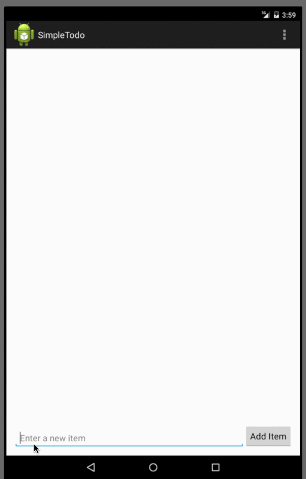

# CodePath-SimpleToDo
<b>Code Path Exercise 0: Simple ToDo</b>

This is an Android demo application for tracking a To-Do list.

Time spent: 5+ hours spent in total

Completed user stories:

 * [x] Required: User view a list of ToDo items
 * [x] Required: User add and remove items
 * [x] Required: User can edit an existing item

Spent some time making the UI work across multiple phone resolutions by playing around with the RelativeLayout.

Notes:

Using Virtual devices were fun, I also tested it on a physical device by exporting the apk file.

Walkthrough of all user stories:

